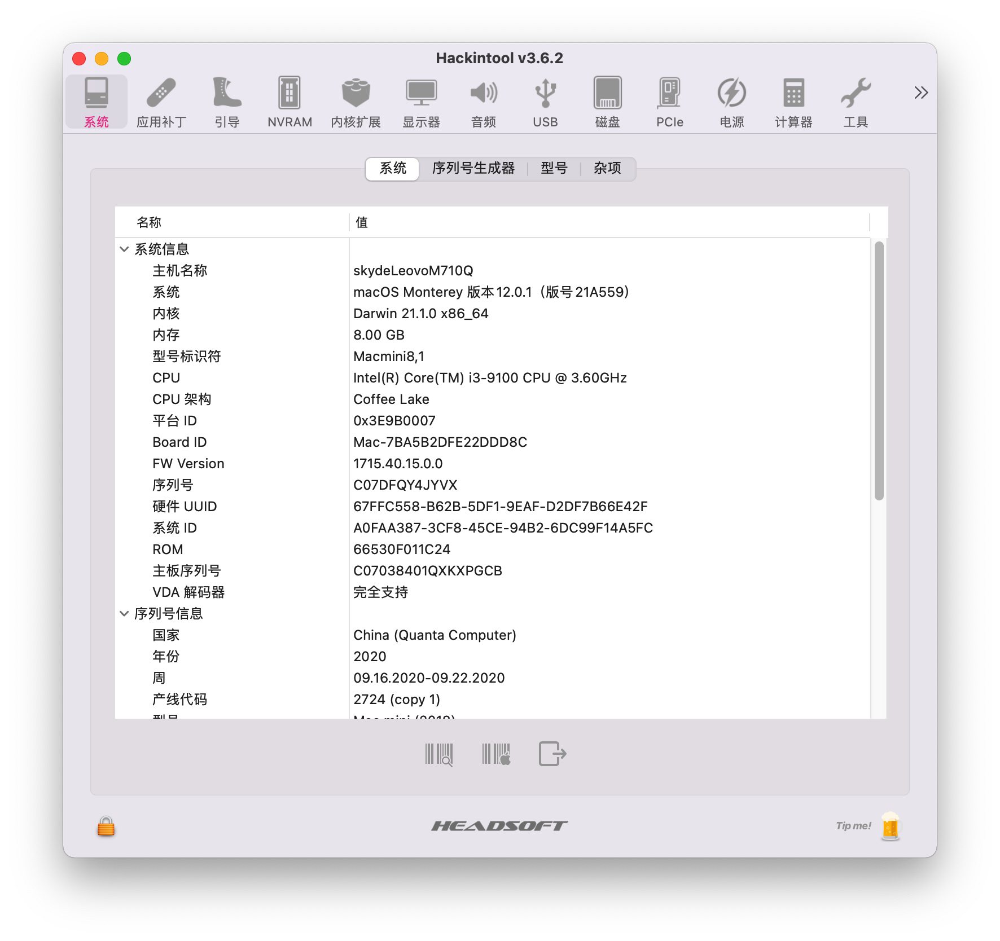
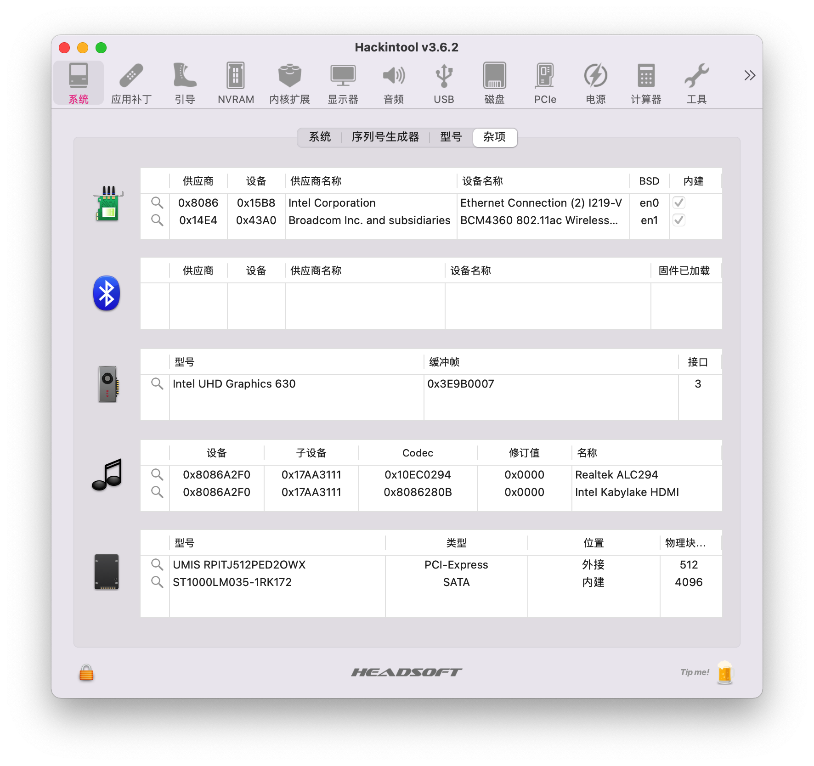
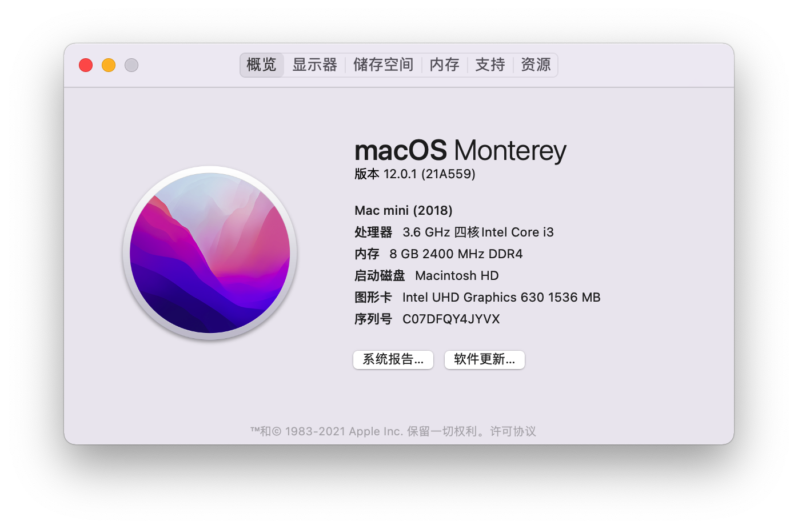
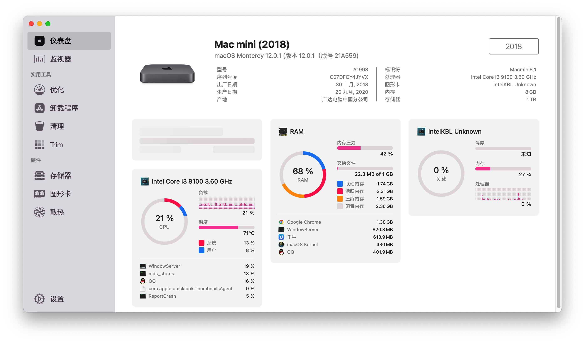

# Lenovo-M710Q-Hackintosh

## Computer Specifications

|   Specification   |                           Details                           |
| :---------------: | :----------------------------------------------------------: |
|   Computer Model  |                       Lenovo M710q                        |
|   Operating System   |                 macOS `Monterey` / `Big Sur`                 |
|      Processor     |                    Intel Core i3-9100                     |
|       Memory        |                             16GB                             |
|      Storage 1      |                          UMIS 512GB                          |
|      Storage 2      |                    ST1000LM035-1RK172 1TB                    |
|        Graphics        |                  Intel HD Graphics CFL CRB                   |
|      Display       |                              None                              |
|        Audio         |                        Realtek ALC294                        |
|       Network      | Replaced with [BCM94360Z4](https://blog.daliansky.net/uploads/WeChatandShop.png) |

## Update Log

- 11-8-2021
  - `OpenCore` `v0.7.6`
  -  Support for `Monterey` installation and usage
- 2-18-2021
  - `OpenCore` `v0.6.6`
- 6-17-2020
  - Fixed USB disconnection issue caused by insufficient power supply
  - 
# BIOS Settings:

1) Update BIOS to M1AKT51A
2) DVMT to 128M
3) Disable CSM

## Screenshots

